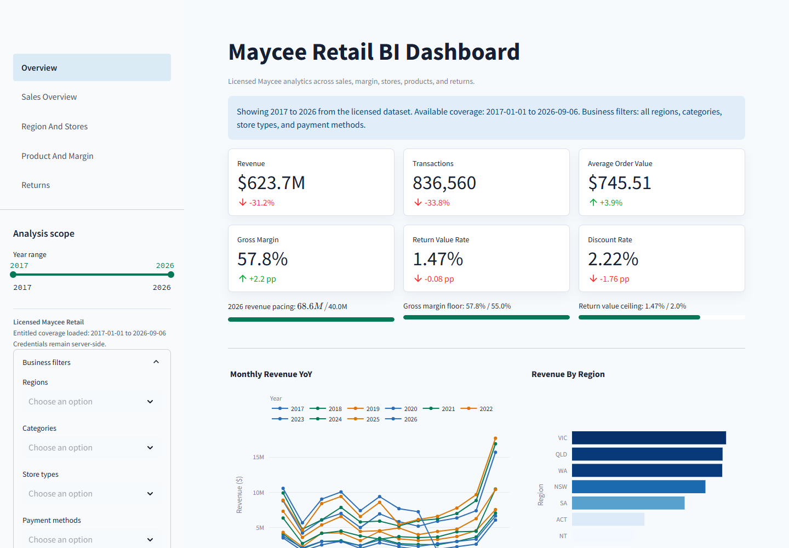

# Maycee Retail BI Dashboard

SData's licensed Maycee Retail analytics dashboard, built with Python,
Streamlit, DuckDB, Pandas, Plotly, and boto3.

The dashboard turns an entitled Maycee Retail snapshot into decision-oriented
views across revenue, margin, returns, products, regions, stores, payment
methods, and customer segments. It includes year-over-year and month-over-month
context, adjustable benchmarks, category return-rate analysis, and shared
business filters.

[Read the SData case study](https://sdatapro.com/blog/maycee-retail-bi-dashboard/)
or [review Maycee Retail access options](https://sdatapro.com/maycee-retail-dataset/).



## Data And Security Boundary

- Licensed Maycee data only, loaded from the S3 scope issued with the licence.
- Credentials are read from an ignored local `.env` and never rendered.
- Downloaded Parquet files stay in the ignored `data/licensed_v1_0/` cache.
- No credentials, licence manifests, fulfilment records, or paid data belong in
  source control, documentation, screenshots, or static reports.
- This repository contains source code and aggregate screenshots only. It does
  not include Maycee Retail data or grant access to it.

See [docs/security_boundary.md](docs/security_boundary.md) for the full rules.

## Local Setup

1. Create the virtual environment and install the pinned requirements.

   Windows PowerShell:

   ```powershell
   py -m venv .venv
   .\.venv\Scripts\python.exe -m pip install -r requirements.txt
   ```

   macOS or Linux:

   ```bash
   python3 -m venv .venv
   .venv/bin/python -m pip install -r requirements.txt
   ```

2. Create `.env` from `.env.example` and enter the values supplied with your
   Maycee licence. Keep this file local and never commit it.

3. Check the entitled fetch plan, then build the local cache.

```powershell
.\.venv\Scripts\python.exe scripts/fetch_licensed_data.py --dry-run
.\.venv\Scripts\python.exe scripts/fetch_licensed_data.py
```

4. Start the dashboard.

```powershell
.\.venv\Scripts\python.exe -m streamlit run app/Overview.py
```

On macOS or Linux, replace `.\.venv\Scripts\python.exe` with
`.venv/bin/python` in the commands above. Open `http://127.0.0.1:8501` after
Streamlit starts.

## Dashboard Views

| View | Focus |
| --- | --- |
| [Sales Overview](docs/images/sales-overview.png) | Revenue movement, payment mix, and customer segments |
| [Region And Stores](docs/images/region-and-stores.png) | Regional contribution and store performance |
| [Product And Margin](docs/images/product-and-margin.png) | Category revenue, product leaders, margin, and promotion impact |
| [Returns](docs/images/returns.png) | Return value, reason codes, and category-level diagnostics |

## Static Review Report

Generate a standalone HTML report from the ignored licensed cache:

```powershell
.\.venv\Scripts\python.exe scripts/build_static_report.py
```

The report is written to `reports/maycee-retail-dashboard.html` and must remain
local unless its aggregate contents and screenshots are explicitly approved
for publication.

## Validation

```powershell
.\.venv\Scripts\python.exe -m unittest discover -s tests
.\.venv\Scripts\python.exe scripts\check_repository_boundary.py
.\.venv\Scripts\python.exe scripts/benchmark_load.py
```

The unit tests generate a small temporary Parquet fixture and do not require
real credentials or Maycee data. The repository-boundary check rejects tracked
secrets and licensed cache paths. The benchmark command requires a populated
licensed cache.

## Local Performance Baseline

Measured on the SData Windows development machine on 8 September 2026:

- Licensed S3 fetch: 10,606 Parquet objects in 178.8 seconds.
- Local cache: 284.9 MiB across 10,607 files including metadata.
- DuckDB load and dashboard-table preparation: 72.648 seconds.
- First-run path from an empty cache to dashboard-ready tables: approximately
  251.4 seconds (4 minutes 11 seconds).
- Loaded coverage: 2017-01-01 through 2026-09-06.
- Loaded facts: 836,560 transactions, 2,122,571 items, and 47,287 returns.

These timings are an observed local baseline, not a performance guarantee;
network, disk, cache state, and snapshot size will change the result.

## Licence

- Dashboard code: MIT, see `LICENSE`.
- Maycee Retail paid data: governed by the applicable SData licence agreement;
  it is not distributed under the dashboard code licence.
